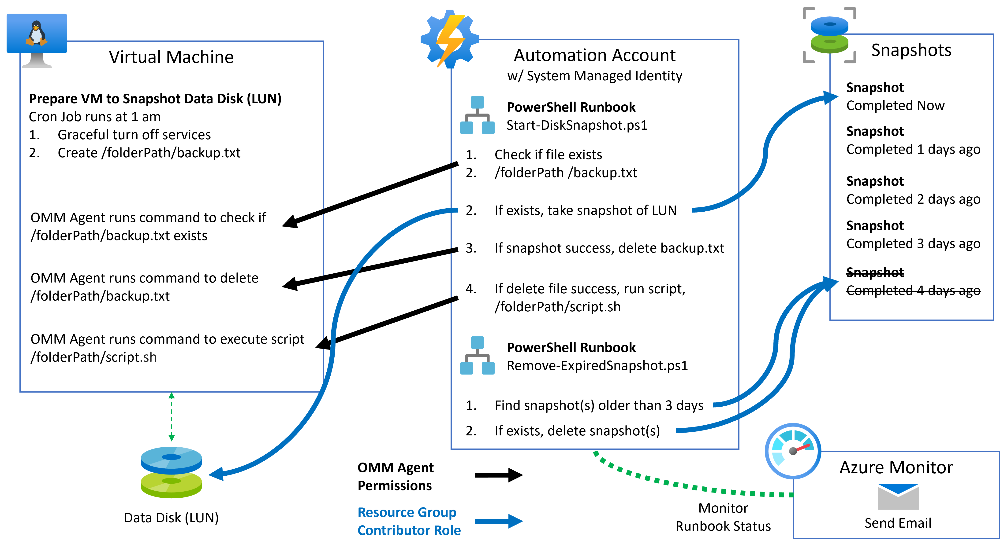

# Automated Management of Disk Snapshots
## Problem

You are running a database or other service that writes data to a disk/LUN in a way that negatively impacts live backups. A quality backup requires the database or service to be gracefully stopped for a quality backup of the data disk.

You want to limit the number of snapshots based using age of snapshot to delete the expired snapshot.

## Solution

#### Resources

The following resources were consulted during the development of this capability.

- https://www.petri.com/automatically-resize-azure-vm
